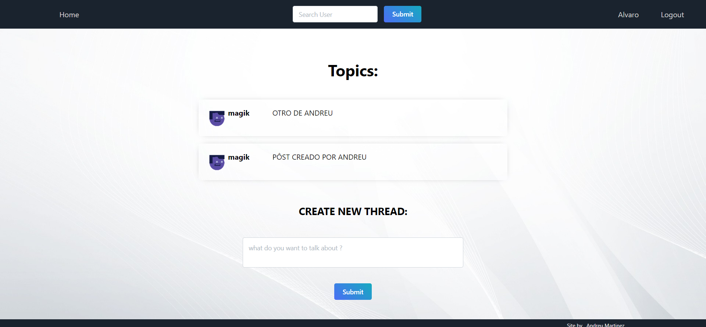
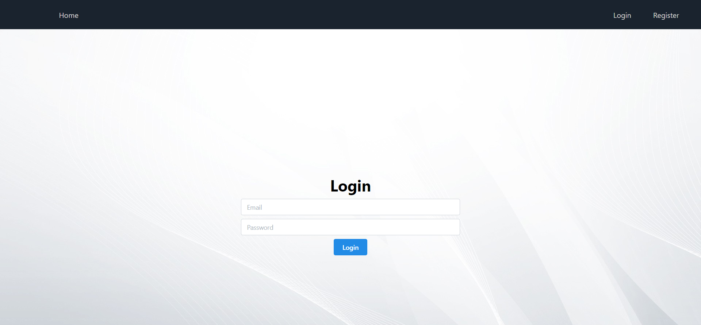
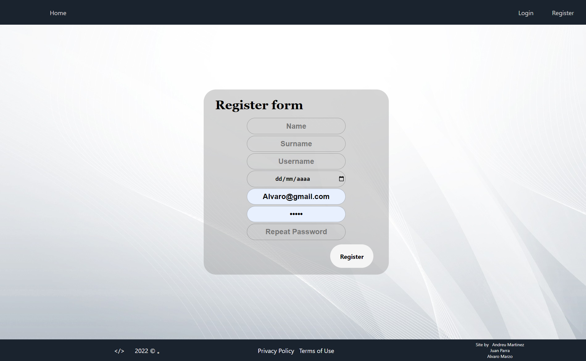
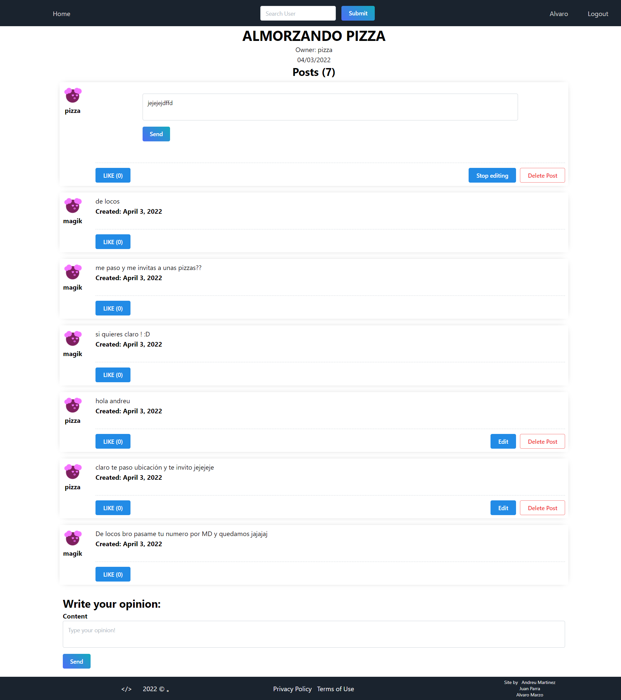
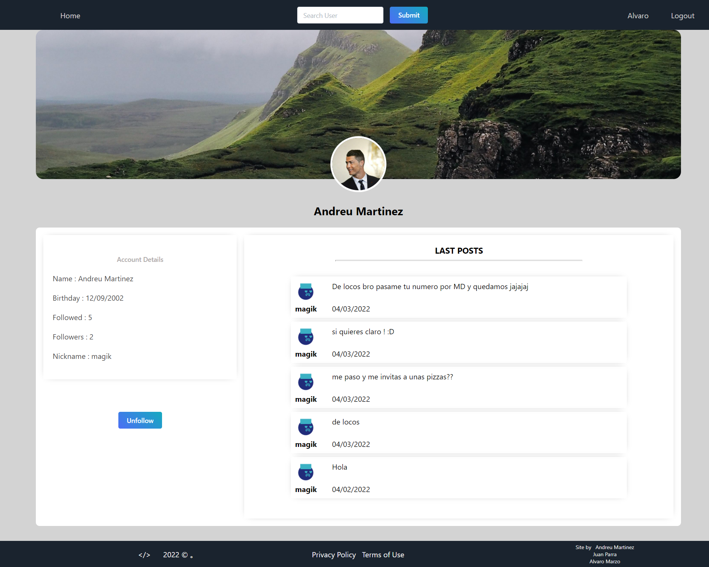
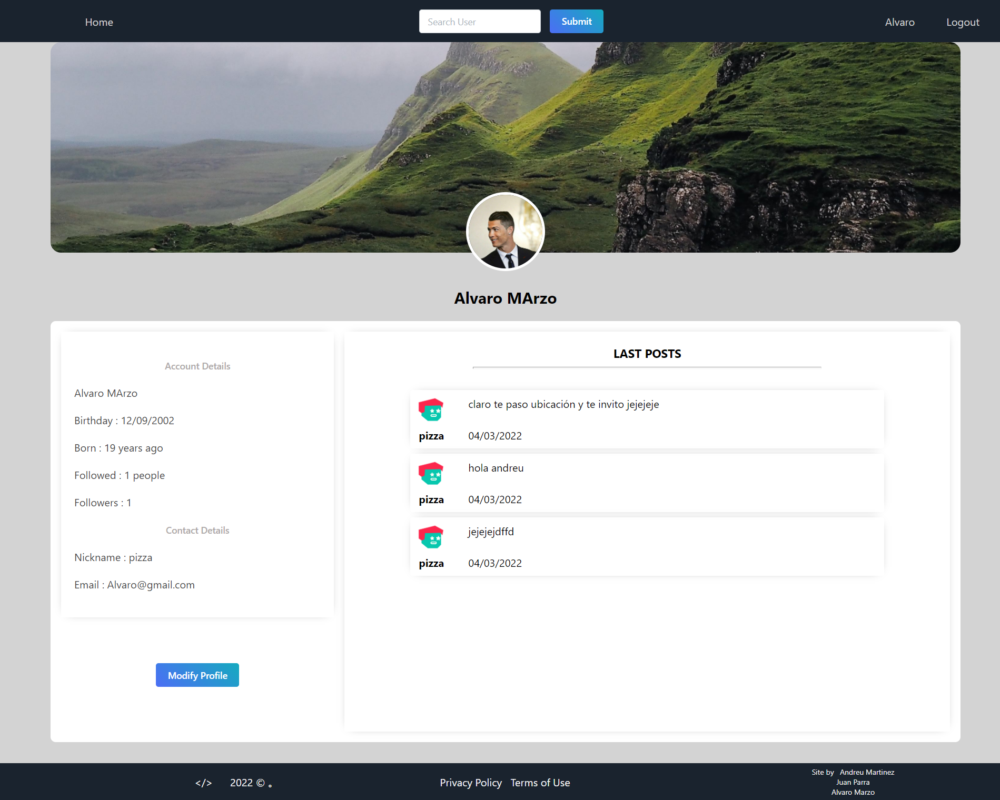
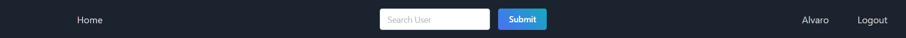

# Frontend MERN

  

Solicitan desde GeeksHubs Academy realizar un frontend para el proyecto de API realizado en el repositorio.

La aplicación consta distintas vistas:

 - Home
 - Login 
 - Register
 - ThreadDetail
 - Users
 - Profile
 

## Home
La vista de home podemos visualizar los hilos creados por los usuarios. 
Al hacer click en un hilo te llevará a la vista del detalle de un hilo.
En la parte inferior tenemos la opción de crear un nuevo hilo si estamos logueados.

## Login 
En la vista de Login podemos loguearnos  poniendo los campos email y contraseña para poder disfrutar de todas las funcionalidades de la aplicación.

## Register
En la vista de Register se solicitan una serie de datos personales mediante un formulario para poder acceder a la aplicación. 

## ThreadDetail
En la parte superior de esta vista se muestra los detalles de un hilo como el título, el creador, la fecha de creación...
Luego se muestran todos los post que contiene el hilo.
Un post contiene un texto, el nombre y avatar del usuario que lo ha realizado y la fecha de creación. Un usuario puede dar like a un post de otro usuario. Si el post es del usuario logueado se mostraran una serie de botones para editar o eliminar su post.
Un usuario que está logueado puede crear un nuevo post en el hilo mediante un formulario.

## Users
En esta vista se muestra el perfil de los distintos usuarios registrados en la aplicación. 
Además de mostrar los datos del usuario y los post más recientes realizados por el usuario, tienes la opción de seguir al usuario mediante un botón de follow/unfollow.

## Profile 
En esta vista se muestra el perfil del usuario logueado.
Además de mostrar los datos del usuario y los post más recientes realizados por el usuario, tienes la opción de modificar el perfil.

## Funcionaliad adicional 

En el componente de Header tiene distintas funcionalidades:

- Buscador de Usuarios (aparece si estás logueado)
- Botón de Login (aparece si no estás logueado)
- Botón de Logout (aparece si estás logueado)
- Botón de Perfil (aparece si estás logueado)

